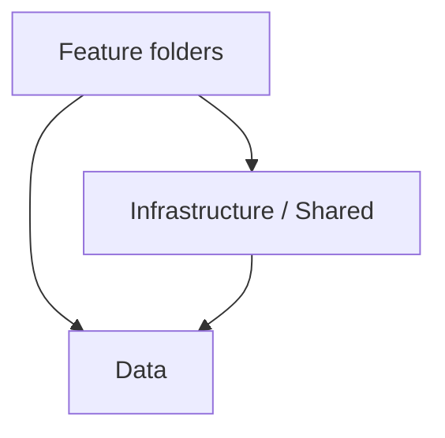

# ASP.NET Core 10 Web API structure

One web project with a shared data layer and feature folders. Every rule has an ID and an enforcement tag:

- `[banned]`: BannedApiAnalyzers (`BannedSymbols.txt`)
- `[analyzer]`: built-in or NuGet analyzer, set in `.editorconfig`
- `[archtest]`: architecture or reflection test in the test project
- `[review]`: human or agent review only

Exact checks are in [enforceable-checks.md](enforceable-checks.md). Layer and feature rules are explained in [module-boundaries.md](module-boundaries.md). A worked example feature is in [reference.md](reference.md).

In an existing repo, match what is already there and list deviations. Do not refactor to this skill unless asked.

## Layout

```
src/{App}.Api/
├── {App}.Api.csproj          # Microsoft.NET.Sdk.Web, net10.0
├── Program.cs                # composition only
├── BannedSymbols.txt
├── Infrastructure/           # startup, auth wiring, dev-only OpenAPI/Scalar, errors, DatabaseInitializer, transaction helper
├── Shared/                   # Result, paging, problems, current user, IDataSeeder, small helpers
├── Data/                     # every entity + its configuration, AppDbContext, Migrations/
│   ├── AppDbContext.cs
│   ├── {Entity}.cs           # entity + IEntityTypeConfiguration<{Entity}>
│   └── Migrations/
├── Identity/                 # feature: users API, role seeding, AppRoles
├── {Feature}/                # one folder per feature
│   ├── {Feature}Module.cs    # AddXModule + MapXModule
│   ├── {Feature}Permissions.cs
│   ├── {Resource}Api.cs      # endpoints + their DTOs
│   ├── {Name}Service.cs      # optional, concrete; owns writes to the feature's entities
│   └── Apis/ Services/       # optional split when the feature grows (MOD-07)
└── Reports/                  # read-only feature: cross-feature display reads
tests/{App}.Api.Tests/        # integration + architecture tests
```

Layers and allowed dependencies (arrows point to what a layer may use):



- **STR-01** One project, `Microsoft.NET.Sdk.Web`, `net10.0`, `<Nullable>enable</Nullable>`, `<ImplicitUsings>enable</ImplicitUsings>`. No class-library layers (Domain/Application/Infrastructure projects). `[archtest]`
- **STR-02** Top-level folders are `Infrastructure/`, `Shared/`, `Data/`, and feature folders (including `Identity/` and `Reports/`). Nothing else. `Migrations/` lives in `Data/`. `[archtest]`
- **STR-03** Namespace = top-level folder: `{App}.Api.{Feature}`, `{App}.Api.Data`, `{App}.Api.Shared`, `{App}.Api.Infrastructure`. Subfolders never add a namespace segment (see STR-07). Turn off IDE0130 (`dotnet_style_namespace_match_folder = false`); the STR-07 test replaces it. `[archtest]`
- **STR-04** Never create `Controllers/`, `DTOs/`, `Interfaces/`, `Repositories/`, `Helpers/`, `Models/`, `Entities/`, or `Contracts/` folders. `Apis/` and `Services/` are allowed only as direct children of a feature folder (MOD-07). Subfolders of `Data/` are allowed for navigation only (DATA-16). `[archtest]`
- **STR-05** No MVC controllers. `[banned]` (`ControllerBase`)
- **STR-06** No Swashbuckle, MediatR, AutoMapper, or FluentValidation package references by default. `[archtest]` (csproj scan)
- **STR-07** One namespace per top-level folder: every file in a feature folder, including `Apis/` and `Services/` subfolders, uses `{App}.Api.{Feature}`; every file in `Data/` (any subfolder) uses `{App}.Api.Data`; `Shared/` and `Infrastructure/` follow the same rule. EF-generated files in `Data/Migrations/` are exempt. A test fails when a file's namespace does not match its top-level folder. `[archtest]`

## Layers and features

- **MOD-01** Each feature has one static `{Feature}Module` class with `Add{Feature}Module(this IServiceCollection, IConfiguration)` and `Map{Feature}Module(this IEndpointRouteBuilder)`. `[archtest]`
- **MOD-02** `AddXModule` registers the feature's services, seeders, and permission policies. `MapXModule` calls the feature's `MapXApi` methods. `[review]`
- **MOD-03** Feature folders may depend on `Infrastructure/`, `Shared/`, `Data/`, and (one direction only, MOD-11) on other features' services. `Data/` depends on no feature and not on `Infrastructure/`; it may use `Shared/`. Nothing in a lower layer ever depends on a feature. `[archtest]`
- **MOD-04** Any feature may read any entity, through navigations, with method-syntax LINQ (`.Where`, `.Select`, `.Include`, `.FirstOrDefaultAsync`). Project to DTOs through navigations (`n.Owner.DisplayName`) instead of `.Join`; `.Join` is discouraged. `[review]` + `[archtest]` for query syntax (DATA-14)
- **MOD-05** Only the owning feature changes the state of its entities (creates, updates, deletes, and derived rows such as history or audit entries). Another feature that needs such a change calls the owning feature's service, inside the same database transaction (MOD-10). `[review]`, optionally a project-specific source scan (enforceable-checks.md, 4.9)
- **MOD-06** `Shared/` depends on nothing in the project. `Infrastructure/` may depend on `Data/` and `Shared/`, never on a feature. `[archtest]`
- **MOD-07** When a feature grows past about 5 files of one kind (`*Api.cs`, services) or one file passes about 300 lines, split that kind into `{Feature}/Apis/` or `{Feature}/Services/`. The split stays inside the feature and keeps its single namespace `{App}.Api.{Feature}` (STR-07). Entities never move into a feature; they stay in `Data/`. `[review]`

### New feature or not

- **MOD-08** Create a new feature folder only when the code has its own endpoints AND its own write rules (entities whose state only it changes). Otherwise put it in the closest existing feature. `[review]`
- **MOD-09** Reads that combine several features' data for display (dashboards, totals, exports) go in `Reports/`. `Reports/` is read-only: it may read any entity, it writes nothing, and no feature or lower layer depends on it. `[archtest]`
- **MOD-10** A service that changes its feature's entities on behalf of another feature uses the same scoped `AppDbContext` and runs inside the caller's transaction (the `Infrastructure/` transaction helper), so the whole command commits or rolls back as one. It must not open its own transaction. `[review]`
- **MOD-11** Features must not form loops. Calls between features go one direction only. `[archtest]`
- **MOD-12** A loop between features is a defect. Fix it in this order:
  1. If the call that closes the loop is a display read, move it to `Reports/` (MOD-09), or read the entities directly through navigations (MOD-04).
  2. Otherwise call a service in one direction only, and let the other side read what it needs through navigations.
  3. Merge the two features only when they keep changing each other's data. Record why in the PR.

  `[review]`
- **MOD-13** Tests enforce MOD-03, MOD-06, MOD-09, and MOD-11:
  - A feature dependency cycle test: a source scan builds the graph from top-level feature folders and fails on any cycle. `Program.cs`, `Infrastructure/`, `Data/`, and `Shared/` are not part of the graph.
  - `Data/`, `Infrastructure/`, and `Shared/` reference no feature namespace; `Shared/` references no other layer.
  - Nothing outside `Reports/` references `Reports/`.
  - Each file in `Data/` is named after the type it declares, and each entity configuration sits in the entity's file (DATA-02).
  - The namespace test (STR-07) and the query-syntax test (DATA-14).

  `[archtest]`

### Strict modules (optional)

Not the default. When a project really needs separate ownership (several teams, or a planned split into services), move each feature's entities and configurations into the feature folder, expose only a `Contracts/` subfolder (records, query and command services, guard interfaces) to other features, replace navigations across features with ID-only foreign keys, and enforce it with a source-scan test that fails when a file uses another feature's types outside its `Contracts/`. Expect more code for cross-feature reads (batched lookups or correlated subqueries) in exchange for hard boundaries. Record the switch in the README, since it overrides STR-04, MOD-04, DATA-02, and DATA-15.

## Program.cs

- **PRG-01** `Program.cs` contains host setup, `AddInfrastructure`, one `AddXModule` per module, the middleware pipeline, one `MapXModule` per module, and nothing else. No endpoint handlers, no policies, no `AddScoped<T>` for module services. `[review]`
- **PRG-02** End the file with `public partial class Program;` so tests can use `WebApplicationFactory<Program>`. `[archtest]`

```csharp
var builder = WebApplication.CreateBuilder(args);
builder.Host.UseDefaultServiceProvider(o => { o.ValidateScopes = true; o.ValidateOnBuild = true; }); // DI-06

builder.Services.AddInfrastructure(builder.Configuration, builder.Environment); // db, auth, OpenAPI, errors, TimeProvider
builder.Services.AddIdentityModule(builder.Configuration);
builder.Services.AddNotesModule(builder.Configuration);
builder.Services.AddReportsModule(builder.Configuration);

var app = builder.Build();

app.UseExceptionHandler();
app.UseStatusCodePages();
app.UseAuthEndpoints();           // authentication, authorization, rate limiting, antiforgery

// DOC-02: Development, or OpenApi:Enabled=true on a test/staging server. Never on real production.
if (app.Environment.IsDevelopment() || app.Configuration.GetValue<bool>("OpenApi:Enabled"))
{
    app.MapOpenApi();
    app.MapScalarApiReference();
}

app.MapAuthEndpoints<AppUser>();  // /identity (+ /account for passkeys)

var api = app.MapGroup("/api");
api.MapIdentityModule();
api.MapNotesModule();
api.MapReportsModule();

app.MapHealthChecks("/health");
app.Run();

public partial class Program;
```

## Endpoints

- **API-01** Minimal APIs only. One resource = one `public static class {Resource}Api` with `Map{Resource}Api(this IEndpointRouteBuilder)` in `{Feature}/{Resource}Api.cs` (or `{Feature}/Apis/` after a MOD-07 split). `[archtest]`
- **API-02** Handlers are named `private static async` methods. Inline lambdas only for one-line routes. `[review]`
- **API-03** Return `TypedResults.*`. Declare the exact union: `Task<Results<Ok<T>, NotFound>>`. Never use `Results.*` or `IResult` as a return type. `[banned]` + `[archtest]`
- **API-04** Routes: camelCase plural nouns (`/notes`, `/noteTags`). Constrain IDs (`{id:long}` or `{id:guid}`). Map literal routes before `{id}`. State changes that are not CRUD are `POST /{id}/{verb}` (`/archive`, `/approve`). `[review]`
- **API-05** Every endpoint has `.WithName("VerbResource")` (unique, becomes the operationId), `.WithSummary(...)`, and a group-level `.WithTags(...)`. `[archtest]`
- **API-06** Every endpoint has `.RequireAuthorization({Feature}Permissions.X)` or an explicit `.AllowAnonymous()`. `[archtest]`
- **API-07** With cookie auth, every POST/PUT/PATCH/DELETE under `/api` has `.RequireAntiforgery()`. `[archtest]`
- **API-08** Every async handler takes a `CancellationToken` and passes it to every async call. `[analyzer]` (CA2016)
- **API-09** Status codes follow this table. `[review]`, plus `[archtest]` for creates (POST to a collection route returns `Created`/`CreatedAtRoute`)

| Operation | Result |
|---|---|
| List | `Ok<PaginatedItems<TResponse>>` with `[AsParameters] PaginationRequest` (`PageIndex` starts at 1, default size 10) |
| Get by ID | `Results<Ok<TResponse>, NotFound>` |
| Create | `Results<CreatedAtRoute<TResponse>, ProblemHttpResult>`: 201 with the body and a `Location` header, via `TypedResults.CreatedAtRoute(dto, "GetResource", new { id })` |
| Update, action with no body | `Results<NoContent, NotFound, ProblemHttpResult>` |
| Delete | `Results<NoContent, NotFound>` |
| File | `FileContentHttpResult` / `FileStreamHttpResult` |

- **API-10** Simple CRUD stays in the handler with `AppDbContext`. Move logic to a concrete `{Name}Service` only when it spans several entities, is reused, or needs a transaction. `[review]`

## DTOs

- **DTO-01** HTTP DTOs live in the same file as their `{Resource}Api` class, below it. `[review]`
- **DTO-02** DTOs are `public sealed record`. Names: `{Verb}{Resource}Request`, `{Resource}Response`, `{Resource}ListItem`. No `Dto` suffix. `[archtest]`
- **DTO-03** Never bind or return an entity type, at any depth. `[archtest]` (endpoint metadata vs EF model)
- **DTO-04** Map in the query: `.Select(x => new NoteResponse(...))`. Do not load entities just to map them. `[review]`
- **DTO-05** HTTP DTOs are not reused across features. A shape another feature needs is a public record next to the owning feature's service; a shape with no feature meaning goes in `Shared/`. `[archtest]`
- **DTO-06** Use `DateTimeOffset` for instants, `DateOnly` for calendar dates. Serialize enums as strings. `[review]`

## Errors and validation

- **ERR-01** Register `AddProblemDetails()`, `UseExceptionHandler()`, and `UseStatusCodePages()`. Unexpected exceptions become a 500 ProblemDetails with no exception details outside Development. This is the only exception handling. Do not add an `IExceptionHandler` that turns exceptions into 4xx. `[archtest]`
- **ERR-02** Validate input with `builder.Services.AddValidation()` and DataAnnotations on request records. Invalid input returns 400 `ValidationProblem` automatically. Cross-field checks in the handler return `TypedResults.ValidationProblem(errors)`. Do not hand-write required or length checks. `[review]`
- **ERR-03** Expected failures are return values, never exceptions. Endpoints return `TypedResults.Problem(...)` through the `Shared/Problems` helpers (`Problems.Conflict(title, detail)`, `Problems.BadRequest(...)`) or `TypedResults.NotFound()`, and declare them in the `Results<...>` union. `[review]`
- **ERR-04** A service method that can fail returns `Shared/Result<T>` (or `Result` without a value): either a value or a `ProblemHttpResult` built with `Problems.*`. The endpoint maps it with `if (result.Problem is { } problem) return problem;`. Reason: the service stays independent of each endpoint's `Results<...>` union, and one line maps it. `[review]`
- **ERR-05** Do not define exception types. Do not throw to signal an expected outcome (not found, conflict, rule violation). Throw only for bugs and broken infrastructure. `[archtest]` (no `Exception` subclasses) + `[review]` (throw sites)
- **ERR-06** Never put exception messages, stack traces, or SQL in a response. `[review]`

## Auth and permissions

- **AUTH-01** Use the `AuthEndpoints` NuGet package (3.x) facade: `AddAuthEndpoints<AppUser, AppRole, AppDbContext>(o => ...)`, `UseAuthEndpoints()` after `UseExceptionHandler()`, `MapAuthEndpoints<AppUser>()`. Do not call `AddIdentityApiEndpoints` yourself. Check https://madeyoga.github.io/AuthEndpoints before using any other AuthEndpoints API. To drop public self-registration, compose `MapCookieAuthEndpoints<AppUser>()` with a management map that omits `/register` (see the "composables" docs) instead of the facade map. `[review]`
- **AUTH-02** Identity keys are `Guid`: `AppUser : IdentityUser<Guid>`, `AppRole : IdentityRole<Guid>`, `AppDbContext : IdentityDbContext<AppUser, AppRole, Guid>`. `AppUser` sets `Id = Guid.CreateVersion7()` in its constructor. `[archtest]`
- **AUTH-03** If passkeys stay enabled, register `AddPasskeyUserIdFactory(() => Guid.CreateVersion7().ToString())` so passkey sign-up does not mint v4 IDs, and set `Passkeys.ServerDomain`. Otherwise set `o.Passkeys.Enabled = false`. `[review]`
- **AUTH-04** Cookie sign-in is the default. Enable JWT or bearer only for a named non-browser client. `[review]`
- **AUTH-05** Register a real `IEmailSender<AppUser>` in Production. Keep `RequireConfirmedAccount = true` unless accounts are created by staff. `[review]`
- **AUTH-06** API requests without a session get 401, not a 302 redirect. Forbidden gets 403. `[archtest]` (integration test)
- **AUTH-07** Permissions are string constants `"{Area}.{Action}"` in `{Feature}/{Feature}Permissions.cs`. One policy per constant, registered in `AddXModule`. Endpoints reference permissions, never role names. `[archtest]`
- **AUTH-08** Read the current user through `Shared/CurrentUser` (claims only, no DB call). Never trust a user ID from the request body. `[review]`

## Data

- **DATA-01** One `AppDbContext` in `Data/`, namespace `{App}.Api.Data`, with migrations in `Data/Migrations/`. `OnModelCreating` calls `base.OnModelCreating` and `ApplyConfigurationsFromAssembly(typeof(AppDbContext).Assembly)`, nothing else. `[review]`
- **DATA-02** One file per entity in `Data/`: the entity class and its `IEntityTypeConfiguration<T>` in the same file, named after the entity (`EntityA.cs`). Small enums and value types used only by that entity may live in the same file; anything used by several entities gets its own file. `ApplyConfigurationsFromAssembly` picks up the configurations. No data annotations for mapping. `[archtest]` + `[banned]` (mapping attributes)
- **DATA-03** `AppDbContext` exposes one `DbSet<T>` property per entity (`public DbSet<Note> Notes => Set<Note>();`). No `db.X()` extension accessors. `[review]`
- **DATA-04** Entity keys: default `long` identity columns. Use `Guid` v7 when the key is exposed publicly and enumeration matters, or the client creates the key (offline or idempotent create). Record the project default in the README. All entities in one aggregate use the same key type. `[review]`
- **DATA-05** Guid keys are set in the app with `Guid.CreateVersion7()` and configured `ValueGeneratedNever()`. Never `Guid.NewGuid()` (v4, poor index locality). `[banned]` + `[archtest]` (EF model)
- **DATA-06** EF calls are async: `SaveChangesAsync`, `ToListAsync`, `FirstOrDefaultAsync`, `MigrateAsync`. `[banned]` for `SaveChanges`/`Migrate`, `[review]` for sync LINQ.
- **DATA-07** Reads use `AsNoTracking()` and project to DTOs. `[review]`
- **DATA-08** Get time from the injected `TimeProvider` (registered as `TimeProvider.System`). Never `DateTime.Now`, `DateTime.UtcNow`, `DateTimeOffset.Now`, or `DateTimeOffset.UtcNow`. Store instants as `timestamptz` in UTC. `[banned]`
- **DATA-09** Raw SQL uses `FromSql`/`SqlQuery`/`ExecuteSql` with interpolation. Never the `*Raw` variants with concatenated strings. `[banned]`
- **DATA-10** Migrations: `dotnet ef migrations add {Name} --output-dir Data/Migrations`. Never edit a migration that has been applied anywhere. Apply migrations automatically only in Development; production runs a migration step or bundle. `[review]`
- **DATA-11** Strings get `HasMaxLength`, decimal amounts get `HasPrecision(18, 2)`, enums get `HasConversion<string>()`. `[review]`
- **DATA-12** Rows with concurrent writers get an `xmin` concurrency token and handle `DbUpdateConcurrencyException`. `[review]`
- **DATA-13** No repository or unit-of-work over EF. Handlers and services use `AppDbContext` directly. Interfaces follow CODE-03. `[archtest]`
- **DATA-14** EF Core and LINQ queries use method syntax (`.Where`, `.Select`, `.Include`, `.FirstOrDefaultAsync`). Query-expression syntax (`from ... select`) is banned. A test parses every `.cs` file with Roslyn and fails on any `QueryExpressionSyntax`. `.Join` is discouraged in favour of navigations. `[archtest]` + `[review]` (`.Join`)
- **DATA-15** Navigations are allowed in both directions between any entities. Configure each relationship once, in the file of the entity that holds the foreign key. `[review]`
- **DATA-16** Keep `Data/` flat. Add subfolders only when it gets hard to navigate (roughly past 40 files). Subfolders are for navigation only: the namespace stays `{App}.Api.Data` and they are not ownership boundaries. `[review]`

## Reusable code and DI

Decide in this order. Examples are in reference.md, "Reusable code".

Static function or service:

- **CODE-01** Pure logic (no I/O, clock, config, state, or logging) is a `static` method or extension method: mapping, formatting, calculations, normalization. Put it in the feature that owns the concept, next to the entity in `Data/` if it is about one entity, or in `Shared/` if it has no feature meaning and two features need it. `[analyzer]` (CA1822)
- **CODE-02** Logic that needs I/O, `AppDbContext`, `HttpClient`, options, `TimeProvider`, the current user, or `ILogger`, or that a test must replace, is a DI service. `[review]`
- **CODE-03** Services are concrete classes. Add an interface only for two or more real implementations, or for an external dependency (email, storage, a third-party HTTP API) that tests must fake. `[archtest]`
- **CODE-04** Static fields are `const` or `static readonly` holding an immutable value (`FrozenDictionary`, `ImmutableArray`, string, record). No mutable static state. `[archtest]` + `[review]` for immutability of the value
- **CODE-05** Business code never resolves from `IServiceProvider` (no service locator). Take dependencies in the constructor or handler parameters. Only `Infrastructure/` hosting code and `*Module` registration may touch `IServiceProvider`. `[archtest]`

Lifetimes:

- **DI-01** Scoped is the default for application services, and required for anything that uses `AppDbContext`, `CurrentUser`, or other per-request data. `[review]`
- **DI-02** Singleton only for stateless types or thread-safe shared state: caches, options wrappers, clients. A singleton never depends on a scoped service, `IOptionsSnapshot<T>`, or `AppDbContext`. Use `IOptionsMonitor<T>` or `IOptions<T>` instead. `[archtest]` (ValidateScopes via the DI-06 host test)
- **DI-03** Transient only for lightweight stateless types, and rarely. No transient `IDisposable`: the container keeps it until the scope ends, and one resolved from the root provider is never released. `[archtest]` (service descriptors)
- **DI-04** Singletons and hosted services that need scoped work inject `IServiceScopeFactory` and create one scope per unit of work (per message, per timer tick, per seeding run). Hosted services never take `AppDbContext` in the constructor. `[archtest]`
- **DI-05** Outgoing HTTP uses `IHttpClientFactory`: `services.AddHttpClient<TClient>()` typed clients. Never `new HttpClient()`. `[banned]`
- **DI-06** Turn on `ValidateScopes` and `ValidateOnBuild` in every environment (`builder.Host.UseDefaultServiceProvider(o => { o.ValidateScopes = true; o.ValidateOnBuild = true; })`). They are on only in Development by default. A test starts the host so a bad graph fails CI. `[archtest]`
- **DI-07** Never call `BuildServiceProvider()` while registering services. Use `AddOptions<T>().Configure<TDep>(...)`, `IConfigureOptions<T>`, or a factory overload. `[banned]` + `[analyzer]` (ASP0000)
- **DI-08** `AppDbContext` is not thread-safe. No `Task.WhenAll`, `Parallel.ForEachAsync`, or unawaited queries over one context. Run queries in sequence, or give each parallel branch its own scope. `[review]`

## Seeding

- **SEED-01** Seed with `IDataSeeder` (`int Order`, `bool IsCritical`, `Task SeedAsync(CancellationToken)`) from `Shared/`. Features register seeders in `AddXModule` with `AddScoped<IDataSeeder, XSeeder>()`. `[archtest]`
- **SEED-02** One `DatabaseInitializer` hosted service in `Infrastructure/Seeding/` runs seeders by `Order` in a scope. A critical seeder failure stops startup. A non-critical failure is logged. `[review]`
- **SEED-03** Seeders are idempotent: check before insert. Roles and the first admin come from seeders, never from handlers. Secrets come from configuration. `[review]`

## OpenAPI

- **DOC-01** `AddOpenApi()` + `Scalar.AspNetCore` (`MapScalarApiReference`). Never Swashbuckle. `[archtest]`
- **DOC-02** Map OpenAPI and Scalar only in Development or when `OpenApi:Enabled` (bool, default `false`) is `true`. The flag is for a test or staging server that runs with `ASPNETCORE_ENVIRONMENT=Production`. It stays off on real production: never set it in `appsettings.json` or `appsettings.Production.json`, only in that server's environment (`OpenApi__Enabled=true`). `[archtest]`
- **DOC-03** Document query parameters with `[Description]`. Mark deprecated operations in an `AddOperationTransformer`, not in comments. Do not use `.WithOpenApi()` (obsolete in .NET 10). `[review]`

## Testing

- **TEST-01** Integration tests use `WebApplicationFactory<Program>` against real PostgreSQL from `Testcontainers.PostgreSql`, one container per test collection, schema created with `MigrateAsync()`. No EF InMemory or SQLite. `[archtest]` (package scan)
- **TEST-02** Each endpoint has at least: success, 401 or 403, and 404 or 400. `[review]`
- **TEST-03** Sign in through the real `/identity/login` and send the antiforgery header from `/identity/csrfToken`. `[review]`
- **TEST-04** Replace `TimeProvider` with `FakeTimeProvider` (`Microsoft.Extensions.TimeProvider.Testing`) in tests that depend on time. `[review]`
- **TEST-05** The architecture tests from enforceable-checks.md live in the same test project and run in CI. `[archtest]`

## Done when

An agent may call a change done only when all of these hold:

- [ ] `dotnet build` passes with zero warnings (`TreatWarningsAsErrors`), including RS0030.
- [ ] `dotnet test` passes, including architecture tests.
- [ ] New feature (only when MOD-08 holds): `{Feature}Module.cs` exists and `Program.cs` calls its `AddXModule` and `MapXModule`.
- [ ] New entity: one file in `Data/` named after it, with the entity and its configuration, plus a `DbSet<T>` property on `AppDbContext`; migration added and reviewed.
- [ ] New endpoint: name, summary, tag, permission or `AllowAnonymous`, antiforgery on unsafe verbs, `CancellationToken`, typed result union, 201 `CreatedAtRoute` for creates, expected failures as `TypedResults.Problem`.
- [ ] New permission: constant in `{Feature}Permissions` and policy registered in `AddXModule`.
- [ ] No entity in any request or response. No feature changes another feature's entities directly (MOD-05). No loop between features, nothing depends on `Reports/`, and every file's namespace matches its top-level folder.
- [ ] Queries use LINQ method syntax only; no query-expression syntax.
- [ ] New service: lifetime chosen by DI-01 to DI-03, concrete unless CODE-03 applies, no `IServiceProvider` in business code.
- [ ] Tests cover success, auth failure, and not-found or validation for each new endpoint.
- [ ] Deviations from this skill are listed in the PR description with a reason.
