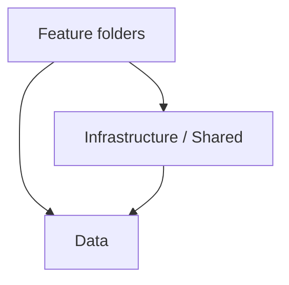

# Layers and feature boundaries

What each layer may use, how features read and write data, and how to keep features from forming loops. IDs match SKILL.md. Checks are in enforceable-checks.md.

## Layers



| Folder | Contains | May depend on |
|---|---|---|
| `{Feature}/` (including `Identity/`, `Reports/`) | `{Feature}Module`, permissions, endpoints and their DTOs, services, seeders | `Infrastructure/`, `Shared/`, `Data/`, and other features' services in one direction (MOD-11). Nothing depends on `Reports/`. |
| `Infrastructure/` | `AddInfrastructure`, auth wiring, dev-only OpenAPI/Scalar, error handling, `DatabaseInitializer`, the transaction helper | `Data/`, `Shared/`. No feature. |
| `Shared/` | `Result<T>`/`Result`, `PaginatedItems<T>`, `PaginationRequest`, `Problems`, `CurrentUser`, `IDataSeeder`, small helpers | Nothing in the project (BCL, ASP.NET Core, EF Core abstractions only). |
| `Data/` | Every entity with its configuration, `AppDbContext`, `Migrations/` | `Shared/` only. No feature, no `Infrastructure/`. |

A feature is a top-level folder, and every file in it uses the single namespace `{App}.Api.{Feature}` (STR-07). Tests find features as top-level folders (source scans) or top-level namespaces (type tests) that are not `Infrastructure`, `Shared`, or `Data`, so a new feature is checked without editing the tests.

Keep `Shared/` small. Add a type there only when at least two features need it and it has no feature meaning. A type with rules of its own belongs to the feature that enforces them, or to `Data/` if it is part of an entity.

## Data/

- One file per entity: the entity, its `IEntityTypeConfiguration<T>`, and its `db.X()` accessor (DATA-03), in `Data/{Entity}.cs`. Small enums and value types used only by that entity may share the file. Anything used by several entities gets its own file, named after the type.
- `AppDbContext : IdentityDbContext<AppUser, AppRole, Guid>` lives in `Data/AppDbContext.cs`. `OnModelCreating` calls `base.OnModelCreating(builder)` then `builder.ApplyConfigurationsFromAssembly(typeof(AppDbContext).Assembly)`, which also finds `internal` configuration classes with a parameterless constructor.
- `AppUser` and `AppRole` are entities, so they live in `Data/` too. The `Identity/` feature owns their state (MOD-05).
- Navigations are allowed in both directions (DATA-15). Configure each relationship once, in the file of the entity that holds the foreign key:

  ```csharp
  builder.HasOne(x => x.Owner).WithMany(u => u.Notes).HasForeignKey(x => x.OwnerUserId).OnDelete(DeleteBehavior.Restrict);
  ```

- Keep `Data/` flat. Past roughly 40 files, group by subfolder for navigation only (DATA-16). The namespace stays `{App}.Api.Data`, and a subfolder is not an ownership boundary.
- Migrations: `dotnet ef migrations add {Name} --output-dir Data/Migrations`. The generated files are exempt from the namespace test.

## Why tests, not `internal`

All folders share one assembly, so `internal` does not stop one feature from using another's types. Mark entities, configurations, services, and endpoint DTOs `internal` where the compiler allows it. That keeps them out of the public surface. The layer rules are enforced by architecture tests (MOD-13); the write rule is a review rule (MOD-05).

Endpoint classes and HTTP DTOs can stay `public`. Minimal API handlers, System.Text.Json, and OpenAPI work with them either way, and public is less friction with the validation source generator.

## Reading data (MOD-04)

- Any feature may read any entity. Start from the set you need and follow navigations: `db.EntitiesA().Where(a => a.Owner.IsActive).Select(a => new EntityAListItem(a.Id, a.Name, a.Owner.DisplayName))`.
- Use method syntax only (DATA-14). Prefer navigations over `.Join`; `.Join` is discouraged and flagged in review.
- Project to DTOs in the query (DTO-04). Use `.Include` only when you load entities to change them.
- No N+1: one query per endpoint where possible, never a query per row in a loop.

## Writing data (MOD-05, MOD-10)

- Each entity has one owning feature. Only that feature creates, updates, or deletes it, and only that feature writes rows derived from it (history, audit, or running totals). Record the owner in the entity's file only if it is not obvious from the name.
- Another feature that needs such a change calls the owning feature's service. The service takes the scoped `AppDbContext`, so both features share one instance per request.
- When one command changes entities of two features, the orchestrating handler or service runs everything in one transaction with the `Infrastructure/` helper. The called service does not open its own transaction.

  ```csharp
  var result = await db.InTransactionAsync(async ct =>
  {
      var changed = await featureBService.ApplyAsync(request.EntityBId, request.Amount, ct);
      if (changed.Problem is { } problem) return problem;                // helper rolls back
      db.EntitiesA().Add(new EntityA { EntityBId = request.EntityBId, CreatedAt = clock.GetUtcNow() });
      await db.SaveChangesAsync(ct);
      return Result.Success;
  }, ct);
  if (result.Problem is { } failed) return failed;
  ```

- A project may add a source scan for its most important write rules, for example "only FeatureA assigns `EntityA.Balance`" (enforceable-checks.md, 4.9). Otherwise the rule is checked in review.

## Loops between features (MOD-11, MOD-12)

- Calls between features go one way. FeatureA may call FeatureB's service, but then FeatureB never calls FeatureA.
- Reading is not a dependency: FeatureB reads FeatureA's entities through `Data/` without calling FeatureA.
- To fix a loop: move a display read to `Reports/`, or read through navigations instead of calling the other feature, or keep a single service call in one direction. Merge the two features only when they keep changing each other's data, and record why in the PR.
- `Reports/` reads anything and writes nothing. No feature and no lower layer depends on it.

## Direct calls vs events

- Default: direct calls to the owning feature's service. They are visible, debuggable, and testable.
- Add in-process events only when a feature must react to another without the publisher knowing about it (for example several features clean up when a user is deleted). Then add a minimal `IEventPublisher` and `IEventHandler<TEvent>` pair in `Shared/`. Handlers run in the same request and scope, inside the same transaction. Event records live in the publishing feature's folder. A handler in FeatureB for FeatureA's event makes B depend on A, so it counts for MOD-11.
- No MediatR, message bus, or outbox until there is a second process that needs it.

## Identity as a feature

`Identity/` owns the state of `AppUser` and `AppRole` (in `Data/`), the users API, role seeding, and `AppRoles` constants. Other features may read users through navigations and may reference `AppRoles` in their permission policies, but they never inject `UserManager<AppUser>` or change users directly. `Shared/CurrentUser` exposes only `Guid? UserId` and permission checks from claims.

## Adding a feature

1. Check MOD-08: own endpoints and own write rules. Otherwise extend the closest feature.
2. Create `{Feature}/` with `{Feature}Module.cs` and `{Feature}Permissions.cs` (namespace `{App}.Api.{Feature}`).
3. Add entities to `Data/`, one file each, and add a migration.
4. Add `{Resource}Api.cs` files and a service for writes other features need. Call the APIs from `Map{Feature}Module`.
5. Call `Add{Feature}Module` and `Map{Feature}Module` in `Program.cs`.
6. Split into `Apis/` and `Services/` later only when MOD-07 says so. The namespace stays `{App}.Api.{Feature}`.
7. Run the architecture tests.
